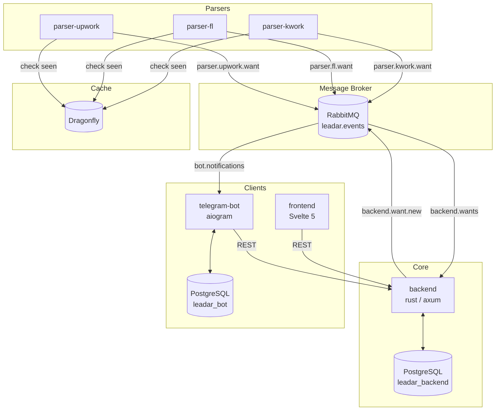
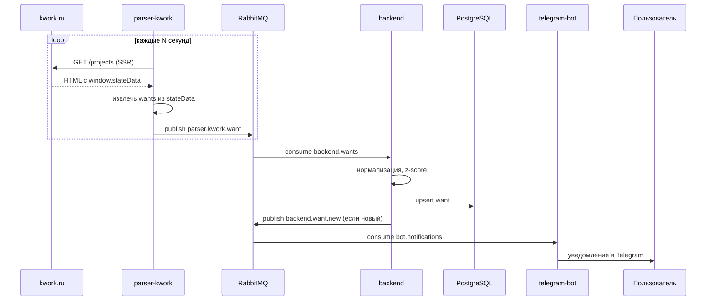
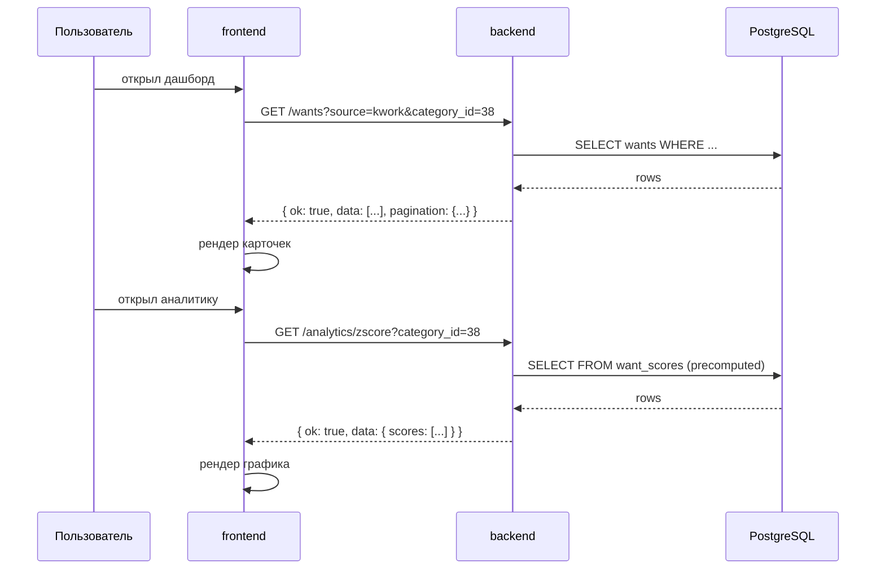
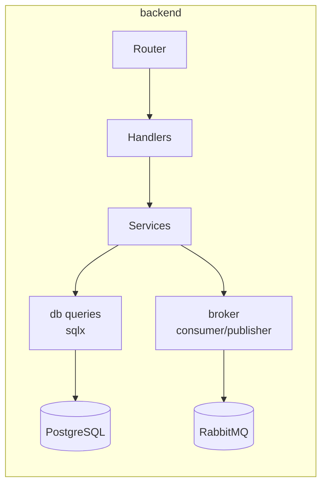

# architecture

общая архитектура leadar — микросервисный сканер фриланс площадок.

---

## репозитории

| репо | язык | назначение |
|---|---|---|
| `backend` | rust / axum | REST API, аналитика, приём событий из брокера |
| `parser-kwork` | python / httpx | парсинг kwork.ru, публикация в rabbitmq |
| `parser-fl` | python / httpx | парсинг fl.ru, публикация в rabbitmq |
| `parser-upwork` | python / httpx | парсинг upwork.com, публикация в rabbitmq |
| `telegram-bot` | python / aiogram | уведомления, аналитика для пользователя |
| `frontend` | Svelte 5 / TypeScript / Vite | фид заказов, фильтры, графики |
| `infrastructure` | docker / nginx | compose файлы, конфиги, миграции |
| `docs` | markdown | вся документация проекта |

---

## диаграмма сервисов

---

## поток данных — новый заказ

---

## поток данных — запрос аналитики

---

## внутренняя структура сервиса (пример — backend)

---

## домены

| окружение | frontend | backend API |
|---|---|---|
| prod | `leadar.qu1nqqy.ru` | `api.leadar.qu1nqqy.ru` |
| dev | `dev.leadar.qu1nqqy.ru` | `api.dev.leadar.qu1nqqy.ru` |

API версионирования нет. Разделение — через сабдомен, не префикс `/api/v1`.

---

## авторизация

Проект **приватный**. Доступ — по whitelist telegram_id.

- **telegram-bot**: middleware проверяет `message.from.id` против `ALLOWED_TELEGRAM_IDS` (env var, список через запятую). Неизвестный ID — отвечаем шаблоном: _"Leadar пока что работает в закрытом режиме. Доступ по подписке — скоро."_
- **frontend**: авторизация через Telegram Login Widget → backend выдаёт httpOnly JWT cookie. Не JWT в body.
- **backend**: все эндпоинты защищены JWT middleware. Исключение — `/health`.

В будущем: отдельный платёжный микросервис, расширение модели доступа.

---

## правила межсервисного взаимодействия

- **парсеры → backend** — только через RabbitMQ, никаких прямых HTTP вызовов
- **парсеры → Dragonfly** — только для проверки дедупликации, не для хранения данных
- **frontend → backend** — только REST через `api.leadar.qu1nqqy.ru`
- **bot → backend** — только REST (синхронные запросы по команде юзера)
- **backend → bot** — только через RabbitMQ (`backend.want.new` → `bot.notifications`)
- **сервисы не ходят в БД друг друга** — у каждого своя база (см. `DATABASE.md`)
- **формат событий** — строго по схеме из `API_CONTRACTS.md`