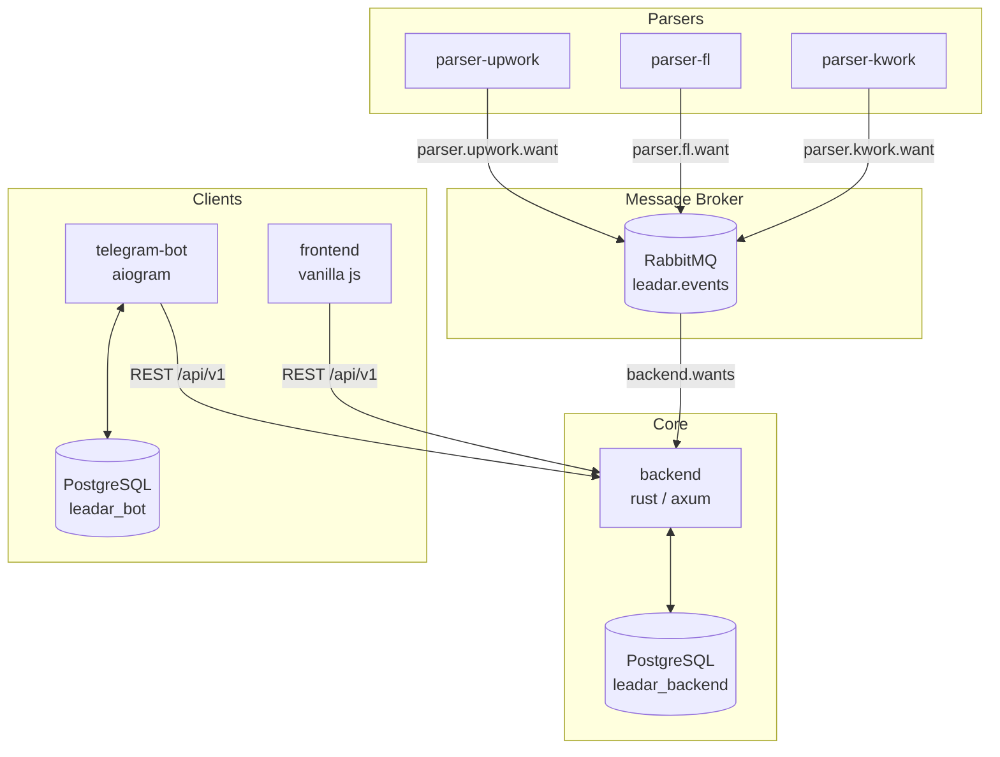
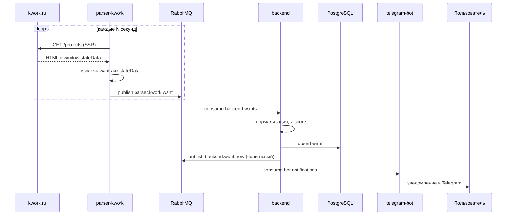
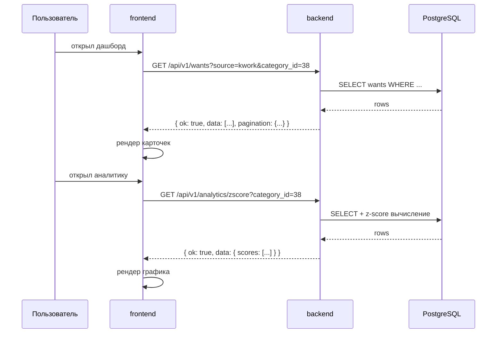
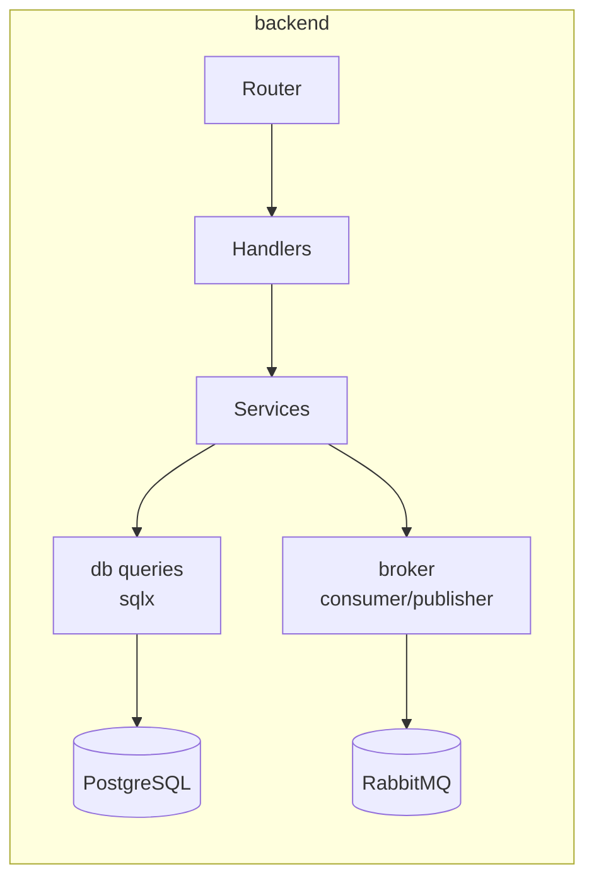

# architecture

общая архитектура leadar — микросервисный сканер фриланс площадок.

---

## репозитории

| репо | язык | назначение |
|---|---|---|
| `backend` | rust / axum | REST API, аналитика, приём событий из брокера |
| `parser-kwork` | python / httpx | парсинг kwork.ru, публикация в rabbitmq |
| `parser-fl` | python / httpx | парсинг fl.ru, публикация в rabbitmq |
| `parser-upwork` | python / httpx | парсинг upwork.com, публикация в rabbitmq |
| `telegram-bot` | python / aiogram | уведомления, аналитика для пользователя |
| `frontend` | vanilla js | фид заказов, фильтры, графики |
| `infrastructure` | docker / nginx | compose файлы, конфиги, миграции |
| `docs` | markdown | вся документация проекта |

---

## диаграмма сервисов

---

## поток данных — новый заказ

---

## поток данных — запрос аналитики

---

## внутренняя структура сервиса (пример — backend)

---

## правила межсервисного взаимодействия

- **парсеры → backend** — только через RabbitMQ, никаких прямых HTTP вызовов
- **frontend → backend** — только REST `/api/v1`
- **bot → backend** — только REST `/api/v1`
- **сервисы не ходят в БД друг друга** — у каждого своя база (см. `DATABASE.md`)
- **формат событий** — строго по схеме из `API_CONTRACTS.md`