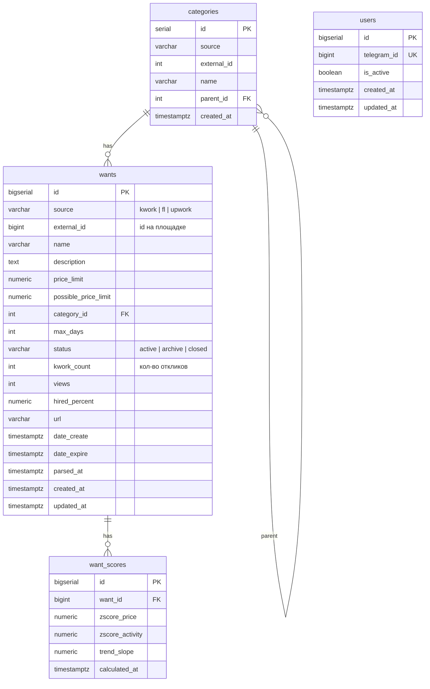
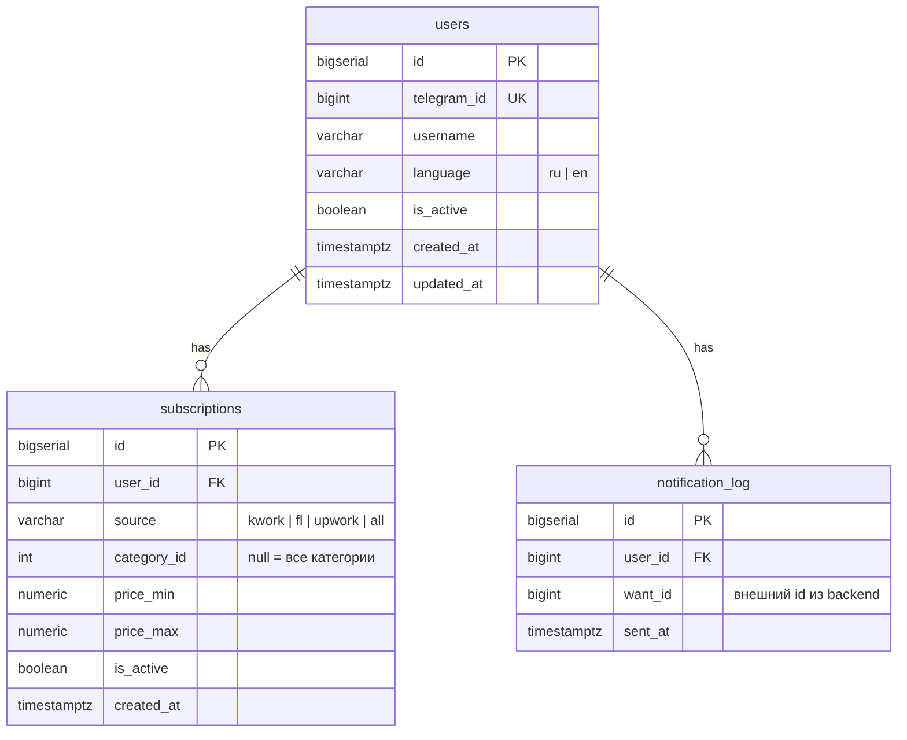

# database conventions

соглашения по базам данных для сервисов leadar.  
**каждый сервис — своя база. прямой доступ к чужой БД запрещён.**

---

## изоляция баз

| сервис | база | владелец данных |
|---|---|---|
| `backend` | `leadar_backend` | users (auth), wants, categories, аналитика |
| `telegram-bot` | `leadar_bot` | профили, подписки, история уведомлений |

парсеры и frontend **не имеют своей БД** — парсеры пишут в брокер, frontend читает через REST.

`leadar_bot` ссылается на пользователей по `telegram_id` — не через FK (разные базы).

---

## схема — leadar_backend



### индексы — leadar_backend

```sql
-- users
CREATE UNIQUE INDEX idx_users_telegram_id ON users(telegram_id);

-- wants — точечные фильтры
CREATE INDEX idx_wants_source ON wants(source);
CREATE INDEX idx_wants_category_id ON wants(category_id);
CREATE INDEX idx_wants_status ON wants(status);
CREATE INDEX idx_wants_date_create ON wants(date_create DESC);
CREATE INDEX idx_wants_date_expire ON wants(date_expire);

-- upsert по внешнему id
CREATE UNIQUE INDEX idx_wants_source_external ON wants(source, external_id);

-- основной паттерн запроса /wants с фильтрами
CREATE INDEX idx_wants_source_category_status ON wants(source, category_id, status);

-- только активные заказы — большинство запросов фронта
CREATE INDEX idx_wants_active ON wants(date_create DESC) WHERE status = 'active';

-- categories
CREATE UNIQUE INDEX idx_categories_source_external ON categories(source, external_id);
CREATE INDEX idx_categories_parent_id ON categories(parent_id);

-- аналитика
CREATE INDEX idx_want_scores_want_id ON want_scores(want_id);
CREATE INDEX idx_want_scores_calculated_at ON want_scores(calculated_at DESC);
```

---

## схема — leadar_bot



### индексы — leadar_bot

```sql
CREATE UNIQUE INDEX idx_users_telegram_id ON users(telegram_id);

CREATE INDEX idx_subscriptions_user_id ON subscriptions(user_id);
-- матчинг подписок при входящем backend.want.new
CREATE INDEX idx_subscriptions_matching ON subscriptions(is_active, source, category_id)
    WHERE is_active = true;

-- защита от дублирующих уведомлений
CREATE UNIQUE INDEX idx_notification_log_user_want ON notification_log(user_id, want_id);
CREATE INDEX idx_notification_log_sent_at ON notification_log(sent_at DESC);
```

---

## соглашения по схемам

### нейминг

```sql
-- таблицы — snake_case, множественное число
wants, categories, want_scores, notification_log

-- колонки — snake_case
external_id, price_limit, date_create

-- индексы — idx_таблица_колонка
idx_wants_source, idx_users_telegram_id

-- FK — таблица_id
user_id, want_id, category_id
```

### типы колонок

| данные | тип |
|---|---|
| ID | `bigserial` (PK), `bigint` (FK) |
| деньги/цены | `numeric(12, 2)` |
| проценты | `numeric(5, 2)` |
| короткий текст | `varchar(255)` |
| длинный текст | `text` |
| дата+время | `timestamptz` (всегда UTC) |
| булево | `boolean` |
| enum-строки | `varchar` + check constraint |

```sql
-- enum через check
ALTER TABLE wants ADD CONSTRAINT chk_wants_status
    CHECK (status IN ('active', 'archive', 'closed'));

ALTER TABLE wants ADD CONSTRAINT chk_wants_source
    CHECK (source IN ('kwork', 'fl', 'upwork'));
```

### обязательные колонки

каждая таблица имеет:

```sql
created_at  timestamptz NOT NULL DEFAULT now()
updated_at  timestamptz NOT NULL DEFAULT now()
```

для `updated_at` — триггер:

```sql
CREATE OR REPLACE FUNCTION set_updated_at()
RETURNS trigger AS $$
BEGIN
    NEW.updated_at = now();
    RETURN NEW;
END;
$$ LANGUAGE plpgsql;

CREATE TRIGGER trg_wants_updated_at
    BEFORE UPDATE ON wants
    FOR EACH ROW EXECUTE FUNCTION set_updated_at();
```

---

## z-score — пересчёт

z-score **не считается при каждом upsert** — это дорого и математически бессмысленно для одной точки.

пересчёт запускается по расписанию внутри backend как `tokio::time::interval`:

```
интервал: каждые 30 минут (ANALYTICS__ZSCORE_INTERVAL в конфиге)
окно выборки: последние 7 дней (ANALYTICS__ZSCORE_WINDOW_DAYS)
```

алгоритм:
1. `SELECT source, category_id, AVG(price_limit), STDDEV(price_limit) FROM wants WHERE created_at > now() - interval`
2. для каждого want в окне: `zscore = (price_limit - avg) / stddev`
3. `INSERT INTO want_scores ... ON CONFLICT (want_id) DO UPDATE`

эндпоинт `/analytics/zscore` только читает из `want_scores` — не считает на лету.

---

## миграции

используем `sqlx migrate` для backend, `alembic` для bot.

```
backend/
  migrations/
    0001_create_categories.sql
    0002_create_wants.sql
    0003_create_want_scores.sql
    0004_add_wants_indexes.sql

telegram-bot/
  migrations/
    0001_create_users.sql
    0002_create_subscriptions.sql
    0003_create_notification_log.sql
```

### правила миграций

- **только вперёд** — down миграций не пишем
- **одна миграция — одно изменение**
- **не редактируем применённые миграции** — только новая миграция
- имя файла: `NNNN_описание_snake_case.sql`